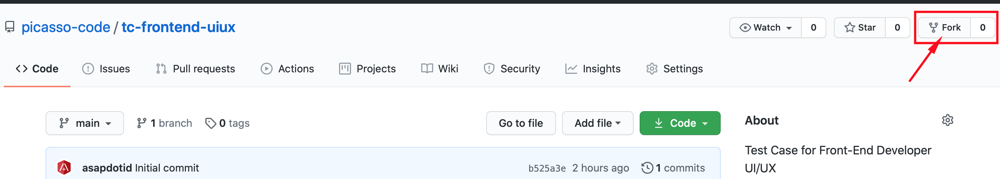

Test Case Front-End Developer (UI/UX)

## I. Discription

Saat ini Picasso sedang mengembangkan system membership online, dimana terdapat beberapa fitur sebagai berikut:

| Authentication    | Dashboard      |
| ----------------- | -------------- |
| - Login           | - Account      |
| - Registrasion    | - Profile      |
| - Forgot Password | - Point        |
|                   | - Stay         |
|                   | - Invoice      |
|                   | - Inbox        |
|                   | - Notification |

Alamat url untuk website: https://member.picassorewards.com, system ini sedang dalam pengembangan terutama tampilan dan interaksi penggunaanya (UI/UX).

## II. Petunjuk Dalam Mengerjakan Soal

#### 1. Dari repository Github Test Case ini, anda diminta untuk:

- **Fork** repository ini ke akun Github anda.
- Pekerjaan anda dalam menjawab soal akan berada di repository anda, misal `https://github.com/user_akun_anda/tc-frontend-uiux`.
- Anda dapat modifikasi file gitignore sesuikan dengan project anda.
- Kami akan melakukan penilaian berdasarkan pekerjaan di repository Github anda.
- Setelah selesai mengerjakan soal yang diberikan sesuai dengan batas waktu yang diberikan, silahkan anda informasikan alamat repositiry Github anda, replay email soal test yang diberikan di `picassograndhotel@gmail.com`.

#### 2. Penilaian

- User Interface (Responsive)
- User Experience
- Clean Code
- CSS/SCSS metode BEM (nilai plus)

## III. Soal

1.  Anda diminta untuk mengunjungi website Membership Picasso https://member.picassorewards.com, mulai dari halaman Authetication & Dashboard. Untuk halaman Dashboard, anda terlebih dahulu registrasi.

    Pertanyaan:

        a. Kritik masing-masing halaman?
        b. Analisa dan saran masing-masing halaman?

    > Untuk jawaban a & b anda bisa tambahkan dibagian **_Jawaban_** (bawah) file README.md.

2.  Dari analisa dan saran (soal 1) menurut anda,
    kami meminta anda untuk membuat design UI/UX baru `(HTML-CSS-JavaScript)`:

    Beberapa bagian atau halaman yang anda buat:

        a. Login

        b. register

        c. Forgot Password

        d. Dashboard Member

        e. Account

        f. Profile

    Catatan:

        - Design yang dibuat memperlihatkan data yng ditampilkan.
        - Anda bebas menggunakan CSS Framework
        - ***Optional*** untuk menggunakan JavaSript Framework (Vue Js, React Js, dll)
        - UI responsive
        - Nilai + jika CSS/SCSS yang dikerjakan menggunakan teknik **BEM**
        - Push pekerjaan anda di repository Github fork.

---

Selamat Mengerjakan.

---

## Jawaban Anda

...
